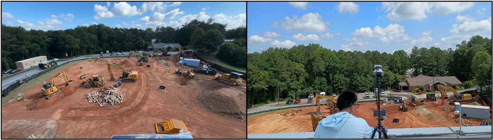

# Construction-Site-Tracking

## LiDAR-based Monitoring System for Construction Site: A Non-machine-learning Approach

#### [[Paper]](https://) | [[Video]](https://)

[[Chao He]] (https://scholar.google.com/citations?user=g4Yv3BkAAAAJ&hl=en) and [[Da Hu]](https://scholar.google.com/citations?user=Y7_j-GMAAAAJ&hl=en&oi=ao) 

Kennesaw State University

This is the official demo for [[Paper]](https://www.mdpi.com/), only includes a part of our data and code. 

The proposed system employs a comprehensive pipeline integrating point cloud pro-cessing, 3D object detection with algorithmic background filtering, and multi-object tracking with Kalman filter-based velocity estimation.

<div align="center">
  <br>
  <strong>Figure 1.</strong> Complete system workflow.
</div>
<br><br>


<div align="center">
  <br>
  <strong>Figure 2.</strong> The setup of the experimental monitoring system.
</div>
<br><br>


<div align="center">
  <br>
  <strong>Figure 3.</strong> Background filtering of point cloud frame.
</div>
<br><br>

<div align="center">
  <br>
  <strong>Figure 4.</strong> Visualization of object detection. (green: worker, red: construction vehicle).
</div>
<br><br>

<div align="center">
  <br>
  <strong>Figure 5.</strong> Workflow of muti-object tracking framework.
</div>
<br><br>

<div align="center">
  <br>
  <strong>Figure 6.</strong> The visualization of the construction site in RViz.
</div>
<br><br>


## 1. Dataset
**Dataset** : 
[[bin]](https://github.com/Saturn-Chao-He/Construction-Site-Tracking/tree/main/bin)

## 2. Environment (Ubuntu 20.04, ROS1 Noetic)

Create Python environment and install the required packages:
```bash
conda env create -f track.yaml
conda activate track

```

## 3. Ternimal 1
Run
```bash
export DISABLE_ROS1_EOL_WARNINGS=1
source /opt/ros/noetic/setup.bash
roscore
```

## 4. Ternimal 2
Run
```bash
rviz -d tracking.rviz -f velodyne
```

## 5. VSCode
Run
```bash
# conda env: track
export DISABLE_ROS1_EOL_WARNINGS=1
source /opt/ros/noetic/setup.bash
python speed.py
```


## Acknowledgement
Great thanks to the Q building of Kennesaw State University.

## Cite
If this project is useful in your research, please cite:
> He, C., & Hu, D. (2025). LiDAR-based Monitoring System for Construction Site: A Non-machine-learning Approach.

